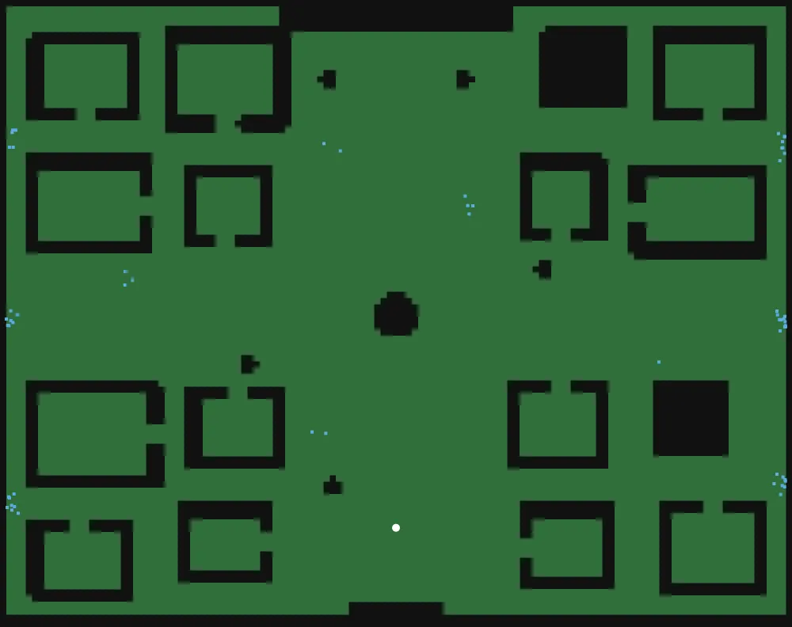
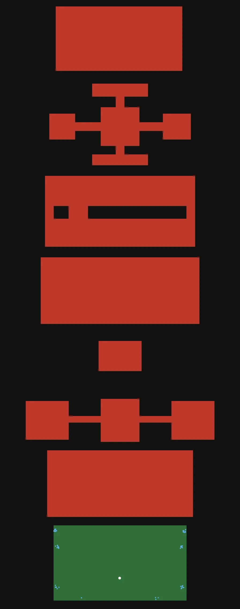
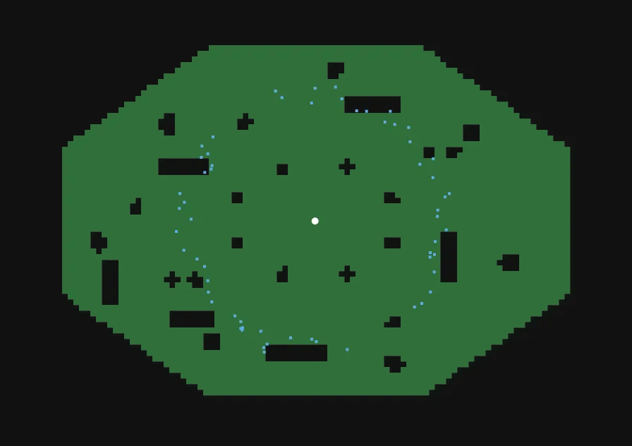
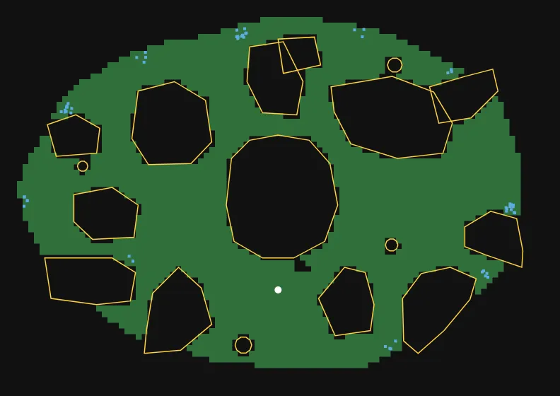
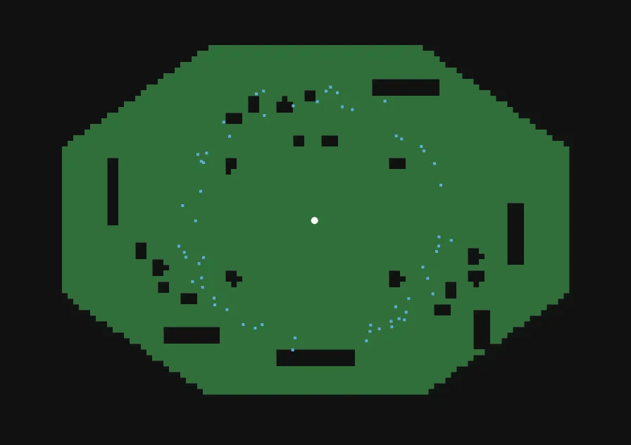
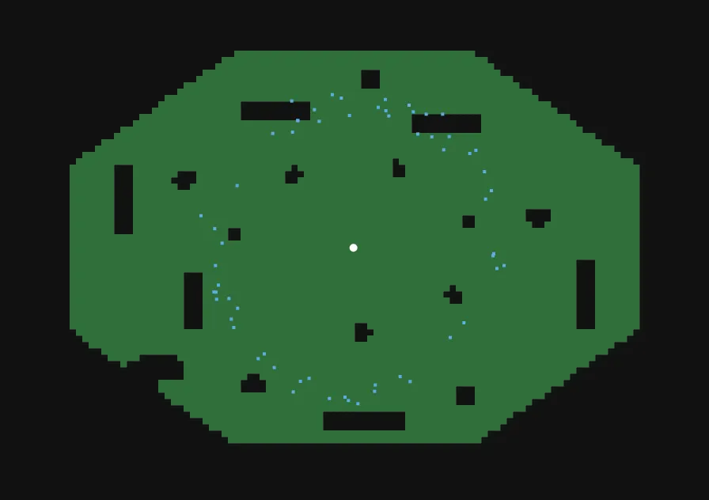
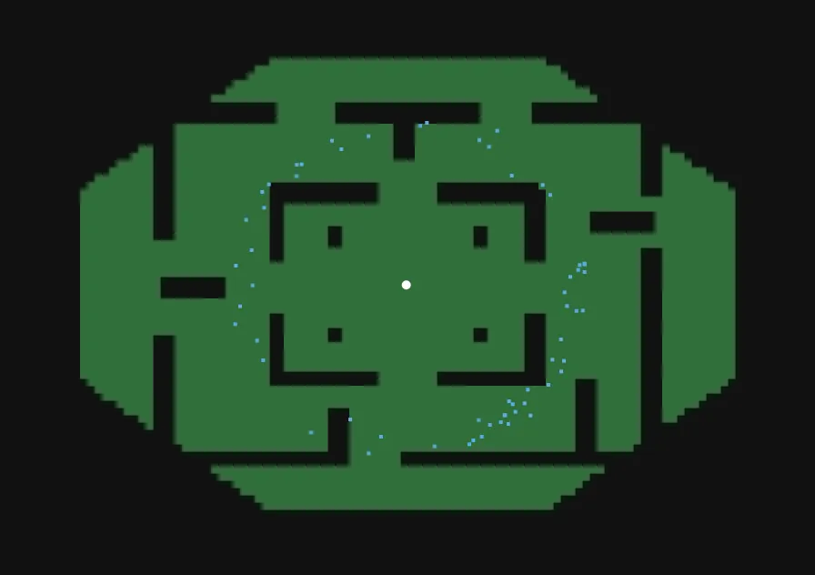
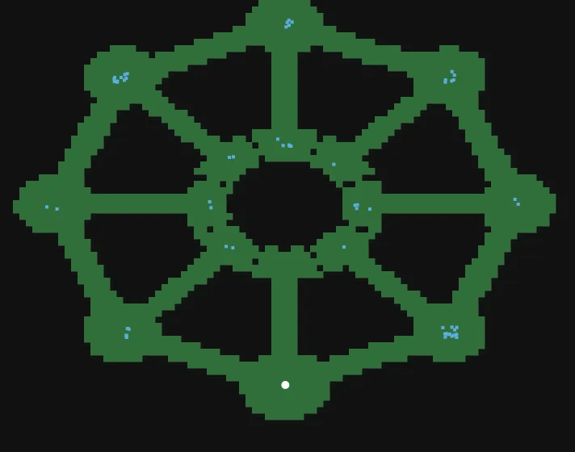
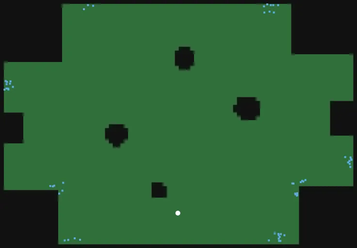
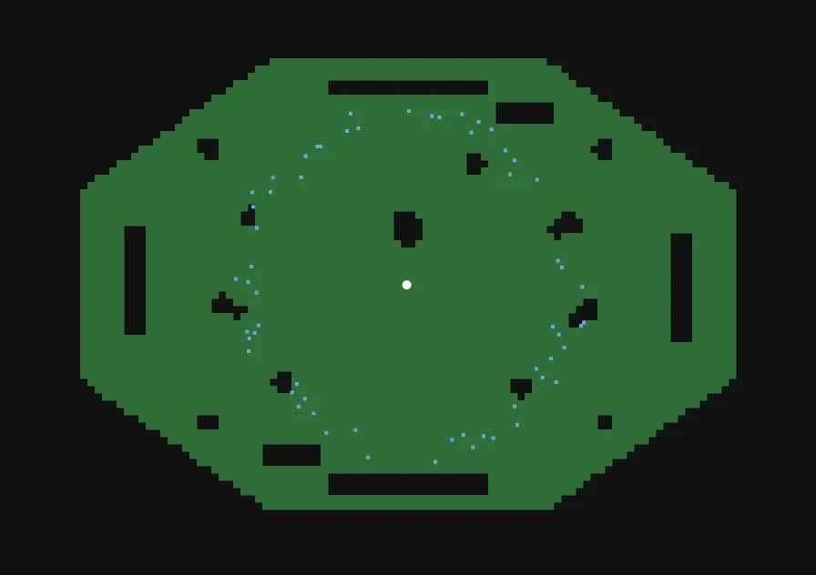

# Auditoría de arenas (AUTO-GENERADO)

> Generado por `node tools/bible/arena-validator.js`. No editar a mano.
> Automated geometry/spawn/exploration checks on the real engine + blueprint completeness. PASS is not a design approval.

Lámina: verde = caminable y alcanzable · rojo = caminable pero inalcanzable (bolsillo) · amarillo = sólido pintado con colisión · magenta = sólido sin colisión / aparición inválida · celeste = aparición válida · blanco = inicio.

| # | Arena | Validador | FAIL | WARN | Diseño | Celdas | Bolsillos | Lámina |
|---|---|---|---|---|---|---|---|---|
| 1 | Ciudad Maldita (`ciudad`) | **WARNING** | 0 | 1 | PASS | 9585 | 0 |  |
| 2 | Fábrica Sin Fin (`fortaleza`) | **WARNING** | 0 | 2 | PASS | 12822 | 7 |  |
| 3 | Ruinas Célticas / Élficas (`bosque`) | **WARNING** | 0 | 1 | PASS | 4326 | 0 |  |
| 4 | Reino Fúngico (`micelial`) | **PASS** | 0 | 0 | PASS | 2567 | 0 |  |
| 5 | Arena Gélida (`hielo`) | **WARNING** | 0 | 1 | FIX | 4337 | 0 |  |
| 6 | Arena Acuática (`acuatica`) | **WARNING** | 0 | 1 | PASS | 4319 | 0 |  |
| 7 | Laberinto (`laberinto`) | **WARNING** | 0 | 1 | PASS | 3838 | 0 |  |
| 8 | Abismo (`abismo`) | **WARNING** | 0 | 2 | PASS | 1838 | 0 |  |
| 9 | Minas Profundas (`minas`) | **WARNING** | 0 | 1 | PASS | 4543 | 0 |  |
| 10 | Arena Infernal (`infernal`) | **WARNING** | 0 | 1 | PASS | 4280 | 0 |  |

## Detalle

### Ciudad Maldita — WARNING
- ✔ **PASS** [blueprint] ficha completa
- ✔ **PASS** [geometry] área caminable conexa — 9585 celdas; 0 bolsillos inalcanzables
- ⚠ **WARNING** [geometry] si se ve sólido, es sólido — la arena no declara sólidos visuales (geometry.solids): revisión manual
- ✔ **PASS** [spawn] apariciones válidas — 120/120 válidas; 0 dentro de colisión, 0 inalcanzables
- ✔ **PASS** [explore] sin NaN — 0
- ✔ **PASS** [explore] nadie fuera del mapa — 0
- ✔ **PASS** [explore] héroes siempre en zona caminable — 0 cuadros-héroe dentro de colisión
- ✔ **PASS** [explore] nunca atrapado — 1800 cuadros de exploración

### Fábrica Sin Fin — WARNING
- ✔ **PASS** [blueprint] ficha completa
- ⚠ **WARNING** [geometry] área caminable conexa — 12822 celdas; 7 bolsillos inalcanzables: 1770@(-8,-3888) 1038@(8,-2920) 1992@(-9,-1958) 2294@(4,-1068) 280@(4,-336) 1170@(4,383) (geometría con compuertas)
- ⚠ **WARNING** [geometry] si se ve sólido, es sólido — la arena no declara sólidos visuales (geometry.solids): revisión manual
- ✔ **PASS** [spawn] apariciones válidas — 120/120 válidas; 0 dentro de colisión, 0 inalcanzables
- ✔ **PASS** [explore] sin NaN — 0
- ✔ **PASS** [explore] nadie fuera del mapa — 0
- ✔ **PASS** [explore] héroes siempre en zona caminable — 0 cuadros-héroe dentro de colisión
- ✔ **PASS** [explore] nunca atrapado — 1800 cuadros de exploración

### Ruinas Célticas / Élficas — WARNING
- ✔ **PASS** [blueprint] ficha completa
- ✔ **PASS** [geometry] área caminable conexa — 4326 celdas; 0 bolsillos inalcanzables
- ⚠ **WARNING** [geometry] si se ve sólido, es sólido — la arena no declara sólidos visuales (geometry.solids): revisión manual
- ✔ **PASS** [spawn] apariciones válidas — 120/120 válidas; 0 dentro de colisión, 0 inalcanzables
- ✔ **PASS** [explore] sin NaN — 0
- ✔ **PASS** [explore] nadie fuera del mapa — 0
- ✔ **PASS** [explore] héroes siempre en zona caminable — 0 cuadros-héroe dentro de colisión
- ✔ **PASS** [explore] nunca atrapado — 1800 cuadros de exploración

### Reino Fúngico — PASS
- ✔ **PASS** [blueprint] ficha completa
- ✔ **PASS** [geometry] área caminable conexa — 2567 celdas; 0 bolsillos inalcanzables
- ✔ **PASS** [geometry] si se ve sólido, es sólido — 17 sólidos pintados con colisión
- ✔ **PASS** [spawn] apariciones válidas — 120/120 válidas; 0 dentro de colisión, 0 inalcanzables
- ✔ **PASS** [explore] sin NaN — 0
- ✔ **PASS** [explore] nadie fuera del mapa — 0
- ✔ **PASS** [explore] héroes siempre en zona caminable — 0 cuadros-héroe dentro de colisión
- ✔ **PASS** [explore] nunca atrapado — 1800 cuadros de exploración

### Arena Gélida — WARNING
- ✔ **PASS** [blueprint] ficha completa
- ✔ **PASS** [geometry] área caminable conexa — 4337 celdas; 0 bolsillos inalcanzables
- ⚠ **WARNING** [geometry] si se ve sólido, es sólido — la arena no declara sólidos visuales (geometry.solids): revisión manual
- ✔ **PASS** [spawn] apariciones válidas — 120/120 válidas; 0 dentro de colisión, 0 inalcanzables
- ✔ **PASS** [explore] sin NaN — 0
- ✔ **PASS** [explore] nadie fuera del mapa — 0
- ✔ **PASS** [explore] héroes siempre en zona caminable — 0 cuadros-héroe dentro de colisión
- ✔ **PASS** [explore] nunca atrapado — 1800 cuadros de exploración

### Arena Acuática — WARNING
- ✔ **PASS** [blueprint] ficha completa
- ✔ **PASS** [geometry] área caminable conexa — 4319 celdas; 0 bolsillos inalcanzables
- ⚠ **WARNING** [geometry] si se ve sólido, es sólido — la arena no declara sólidos visuales (geometry.solids): revisión manual
- ✔ **PASS** [spawn] apariciones válidas — 120/120 válidas; 0 dentro de colisión, 0 inalcanzables
- ✔ **PASS** [explore] sin NaN — 0
- ✔ **PASS** [explore] nadie fuera del mapa — 0
- ✔ **PASS** [explore] héroes siempre en zona caminable — 0 cuadros-héroe dentro de colisión
- ✔ **PASS** [explore] nunca atrapado — 1800 cuadros de exploración

### Laberinto — WARNING
- ✔ **PASS** [blueprint] ficha completa
- ✔ **PASS** [geometry] área caminable conexa — 3838 celdas; 0 bolsillos inalcanzables
- ⚠ **WARNING** [geometry] si se ve sólido, es sólido — la arena no declara sólidos visuales (geometry.solids): revisión manual
- ✔ **PASS** [spawn] apariciones válidas — 120/120 válidas; 0 dentro de colisión, 0 inalcanzables
- ✔ **PASS** [explore] sin NaN — 0
- ✔ **PASS** [explore] nadie fuera del mapa — 0
- ✔ **PASS** [explore] héroes siempre en zona caminable — 0 cuadros-héroe dentro de colisión
- ✔ **PASS** [explore] nunca atrapado — 1800 cuadros de exploración

### Abismo — WARNING
- ✔ **PASS** [blueprint] ficha completa
- ✔ **PASS** [geometry] área caminable conexa — 1838 celdas; 0 bolsillos inalcanzables
- ⚠ **WARNING** [geometry] si se ve sólido, es sólido — la arena no declara sólidos visuales (geometry.solids): revisión manual
- ✔ **PASS** [spawn] apariciones válidas — 120/120 válidas; 0 dentro de colisión, 0 inalcanzables
- ✔ **PASS** [explore] sin NaN — 0
- ✔ **PASS** [explore] nadie fuera del mapa — 0
- ⚠ **WARNING** [explore] héroes siempre en zona caminable — 116 cuadros-héroe dentro de colisión [["tanque",324,616,597,""],["tanque",325,623,598,""],["tanque",325,629,599,""],["tanque",321,637,600,"abHang"],["tanque",321,637,601,"abHang"]] (arena con caídas: colgado del borde)
- ✔ **PASS** [explore] nunca atrapado — 1800 cuadros de exploración

### Minas Profundas — WARNING
- ✔ **PASS** [blueprint] ficha completa
- ✔ **PASS** [geometry] área caminable conexa — 4543 celdas; 0 bolsillos inalcanzables
- ⚠ **WARNING** [geometry] si se ve sólido, es sólido — la arena no declara sólidos visuales (geometry.solids): revisión manual
- ✔ **PASS** [spawn] apariciones válidas — 120/120 válidas; 0 dentro de colisión, 0 inalcanzables
- ✔ **PASS** [explore] sin NaN — 0
- ✔ **PASS** [explore] nadie fuera del mapa — 0
- ✔ **PASS** [explore] héroes siempre en zona caminable — 0 cuadros-héroe dentro de colisión
- ✔ **PASS** [explore] nunca atrapado — 1800 cuadros de exploración

### Arena Infernal — WARNING
- ✔ **PASS** [blueprint] ficha completa
- ✔ **PASS** [geometry] área caminable conexa — 4280 celdas; 0 bolsillos inalcanzables
- ⚠ **WARNING** [geometry] si se ve sólido, es sólido — la arena no declara sólidos visuales (geometry.solids): revisión manual
- ✔ **PASS** [spawn] apariciones válidas — 120/120 válidas; 0 dentro de colisión, 0 inalcanzables
- ✔ **PASS** [explore] sin NaN — 0
- ✔ **PASS** [explore] nadie fuera del mapa — 0
- ✔ **PASS** [explore] héroes siempre en zona caminable — 0 cuadros-héroe dentro de colisión
- ✔ **PASS** [explore] nunca atrapado — 1800 cuadros de exploración

