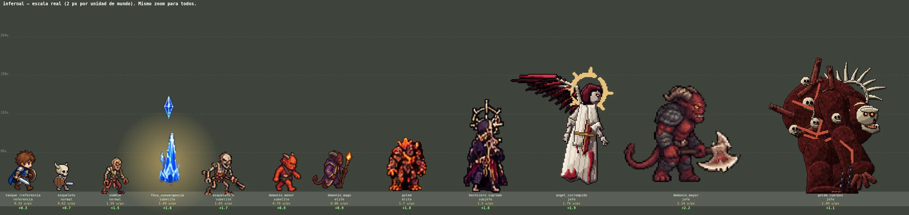
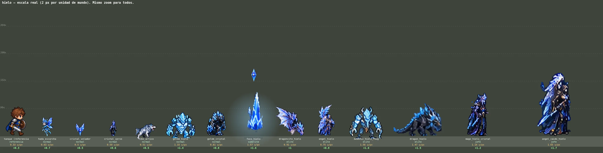
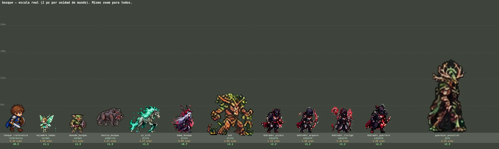
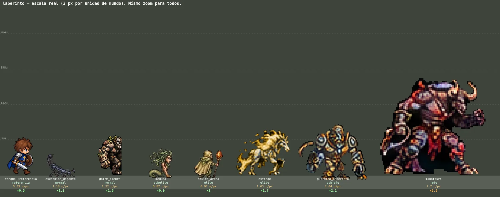
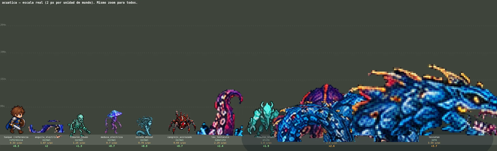
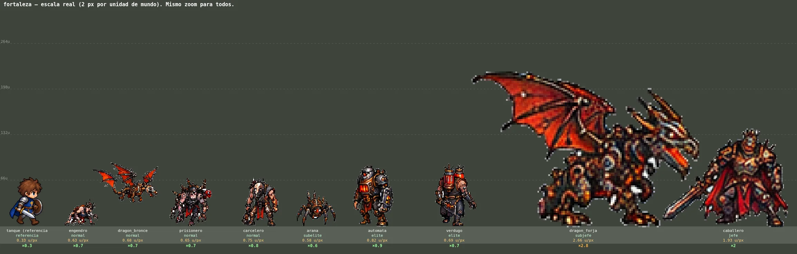
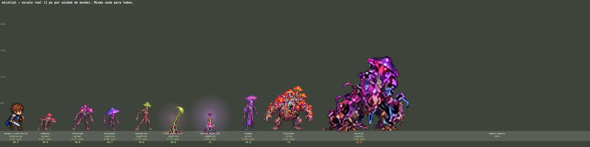
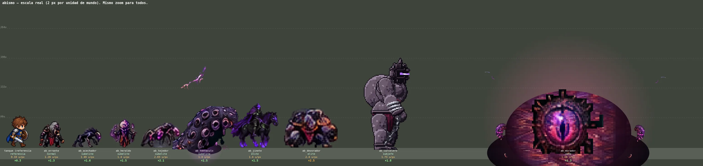
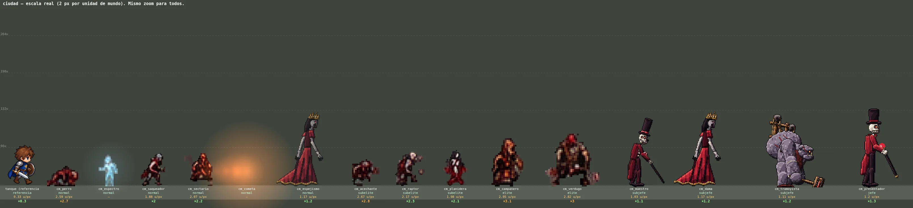
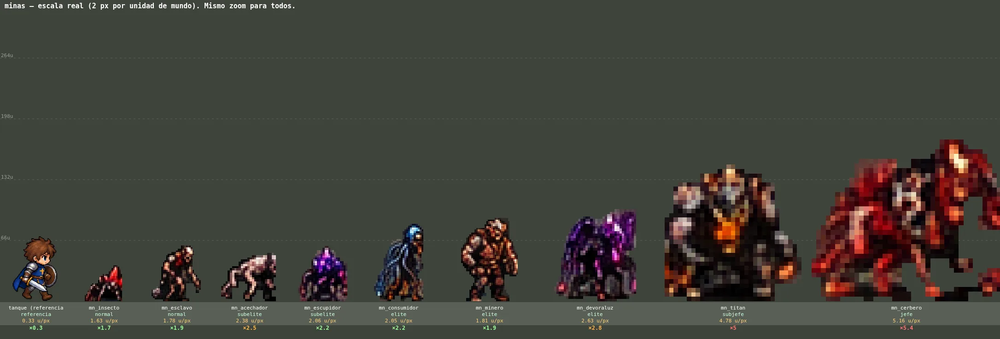

# Auditoría de arte de enemigos y jefes (AUTO-GENERADO)

> `node tools/art/arena_lineup.js --report` (servidor en `LINEUP_BASE_URL`). Cada tipo dibujado con el código del juego, a escala real y con el mismo zoom, junto al Caballero (Master Reference, docs/ART_BIBLE.md §2). **Densidad** = unidades de mundo por píxel de arte; **×** = cuántas veces más grueso que la densidad típica de los campeones (mediana del roster: 0.95 u/px, 29 campeones; el Caballero se dibuja a la izquierda como referencia de estilo, pero su atlas viene de una fuente de alta resolución y no sirve como vara de densidad). Umbral: ≤ ×2,5 PASS · ×2,5–4 FIX (vigilar; los jefes pueden tener más detalle, no píxeles más gruesos) · ≥ ×4 REDRAW por mezcla de densidades (ART_BIBLE §1). Mide; no decide estilo: el Visual Gate (§8) sigue siendo humano.

Jefes y subjefes: estado de arte completo (cuerpos prestados, poses faltantes, encargos) en `BOSS_BLUEPRINTS` y `BOSS_AUDIT.md`; encargos en `docs/ART_COMMISSION_BRIEF.md`.

## infernal

| Tipo | Rango | u/px | × roster | Densidad | Arte principal |
|---|---|---|---|---|---|
| tanque (referencia) | campeón | 0.33 | ×0.3 | referencia | `assets/sprites/champions/tanque/atlas.webp` |
| esqueleto | normal | 0.62 | ×0.7 | PASS | `assets/sprites/enemies/infernal/esqueleto/atlas.webp` |
| zombie | normal | 1.39 | ×1.5 | PASS | `assets/sprites/enemies/infernal/zombie/walk1.webp` |
| foco_convergencia | subelite | 1.49 | ×1.6 | PASS | `assets/vfx/bosses/hielo/bsAngelPillar_1.webp` |
| esqueleto_h | subelite | 1.65 | ×1.7 | PASS | `assets/sprites/enemies/infernal/esqueleto_h/walk1.webp` |
| demonio_menor | subelite | 0.79 | ×0.8 | PASS | `assets/sprites/enemies/infernal/demonio_menor/atlas.webp` |
| demonio_mago | elite | 0.86 | ×0.9 | PASS | `assets/sprites/enemies/infernal/demonio_mago/atlas.webp` |
| golem | elite | 1.7 | ×1.8 | PASS | `assets/sprites/enemies/infernal/golem/v2/atlas.webp` |
| hechicero_supremo | subjefe | 1.5 | ×1.6 | PASS | `assets/sprites/bosses/infernal/hechicero/atlas.webp` |
| angel_corrompido | jefe | 1.79 | ×1.9 | PASS | `assets/sprites/bosses/infernal/hechicero/angel/atlas.webp` |
| demonio_mayor | jefe | 2.14 | ×2.2 | PASS | `assets/sprites/bosses/infernal/demonio_mayor/atlas.webp` |
| golem_cuerpos | jefe | 1.09 | ×1.1 | PASS | `assets/sprites/bosses/infernal/hechicero/golem/v2/atlas.webp` |

## hielo

| Tipo | Rango | u/px | × roster | Densidad | Arte principal |
|---|---|---|---|---|---|
| tanque (referencia) | campeón | 0.33 | ×0.3 | referencia | `assets/sprites/champions/tanque/atlas.webp` |
| hada_escarcha | normal | 0.63 | ×0.7 | PASS | `assets/sprites/enemies/hielo/hada_escarcha/atlas.webp` |
| cristal_volador | normal | 0.5 | ×0.5 | PASS | `assets/sprites/enemies/hielo/cristal_volador/atlas.webp` |
| cristal_servo | normal | 0.59 | ×0.6 | PASS | `assets/sprites/enemies/hielo/cristal_servo/atlas.webp` |
| lobo_artico | normal | 0.51 | ×0.5 | PASS | `assets/sprites/enemies/hielo/lobo_artico/atlas.webp` |
| golem_hielo | normal | 1.33 | ×1.4 | PASS | `assets/sprites/enemies/hielo/golem_hielo/walk1.webp` |
| golem_cristal | normal | 0.81 | ×0.8 | PASS | `assets/sprites/enemies/hielo/golem_cristal/atlas.webp` |
| foco_hielo | subelite | 1.57 | ×1.6 | PASS | `assets/vfx/bosses/hielo/bsAngelPillar_1.webp` |
| dragoncito_hielo | elite | 0.91 | ×1 | PASS | `assets/sprites/enemies/hielo/dragoncito_hielo/v2/atlas.webp` |
| angel_hielo | elite | 0.75 | ×0.8 | PASS | `assets/sprites/enemies/hielo/angel_hielo/v2/atlas.webp` |
| demonio_hielo_fuego | elite | 1.56 | ×1.6 | PASS | `assets/sprites/enemies/hielo/demonio_hielo_fuego/walk1.webp` |
| dragon_hielo | elite | 1.47 | ×1.5 | PASS | `assets/sprites/enemies/hielo/dragon_hielo/v2/atlas.webp` |
| mago_hielo_cristal | jefe | 1.14 | ×1.2 | PASS | `assets/sprites/bosses/hielo/mago_hielo_cristal/v2/atlas.webp` |
| angel_caido_hielo | jefe | 1.65 | ×1.7 | PASS | `assets/sprites/bosses/hielo/angel_caido_hielo/v2/atlas.webp` |

## bosque

| Tipo | Rango | u/px | × roster | Densidad | Arte principal |
|---|---|---|---|---|---|
| tanque (referencia) | campeón | 0.33 | ×0.3 | referencia | `assets/sprites/champions/tanque/atlas.webp` |
| enjambre_hadas | normal | 1.04 | ×1.1 | PASS | `assets/sprites/enemies/bosque/enjambre_hadas/v3/atlas.webp` |
| duende_bosque | normal | 1.2 | ×1.3 | PASS | `36x41` |
| bestia_bosque | subelite | 1.27 | ×1.3 | PASS | `55x54` |
| cu_sith | elite | 1.34 | ×1.4 | PASS | `assets/sprites/enemies/bosque/cu_sith/v3/atlas.webp` |
| dama_bosque | elite | 0.69 | ×0.7 | PASS | `assets/sprites/enemies/bosque/dama_bosque/v2/atlas.webp` |
| ent | elite | 1.94 | ×2 | PASS | `assets/sprites/enemies/bosque/ent/walk1.webp` |
| doblador_picaro | subjefe | 1.13 | ×1.2 | PASS | `assets/sprites/bosses/bosque/doblador_picaro/v2/atlas.webp` |
| doblador_arquera | subjefe | 1.16 | ×1.2 | PASS | `assets/sprites/bosses/bosque/doblador_arquera/v2/atlas.webp` |
| doblador_clerigo | subjefe | 1.16 | ×1.2 | PASS | `assets/sprites/bosses/bosque/doblador_clerigo/v2/atlas.webp` |
| doblador_guerrero | subjefe | 1.28 | ×1.3 | PASS | `assets/sprites/bosses/bosque/doblador_guerrero/v2/atlas.webp` |
| guardian_ancestral | jefe | 2.15 | ×2.3 | PASS | `assets/sprites/bosses/bosque/guardian_ancestral/atlas.webp` |

## laberinto

| Tipo | Rango | u/px | × roster | Densidad | Arte principal |
|---|---|---|---|---|---|
| tanque (referencia) | campeón | 0.33 | ×0.3 | referencia | `assets/sprites/champions/tanque/atlas.webp` |
| escorpion_gigante | normal | 1.18 | ×1.2 | PASS | `assets/sprites/enemies/laberinto/escorpion_gigante/walk-strip.webp` |
| golem_piedra | normal | 1.22 | ×1.3 | PASS | `assets/sprites/enemies/laberinto/golem_piedra/v2/atlas.webp` |
| medusa | subelite | 0.87 | ×0.9 | PASS | `assets/sprites/enemies/laberinto/medusa/walk-strip.webp` |
| druida_arena | elite | 0.97 | ×1 | PASS | `assets/sprites/enemies/laberinto/druida_arena/walk-strip.webp` |
| esfinge | elite | 1.63 | ×1.7 | PASS | `872x120` |
| guardian_laberinto | subjefe | 2.04 | ×2.1 | PASS | `assets/sprites/bosses/laberinto/guardian_laberinto/walk1.webp` |
| minotauro | jefe | 2.7 | ×2.8 | FIX (vigilar) | `assets/sprites/bosses/laberinto/minotauro/v3/atlas.webp` |

## acuatica

| Tipo | Rango | u/px | × roster | Densidad | Arte principal |
|---|---|---|---|---|---|
| tanque (referencia) | campeón | 0.33 | ×0.3 | referencia | `assets/sprites/champions/tanque/atlas.webp` |
| anguila_electrica | normal | 1.87 | ×2 | PASS | `assets/sprites/enemies/acuatica/anguila_electrica/idle_01.webp` |
| tiburon_joven | normal | 1.25 | ×1.3 | PASS | `592x104` |
| medusa_electrica | normal | 0.7 | ×0.7 | PASS | `1744x210` |
| sirena_abisal | normal | 0.79 | ×0.8 | PASS | `2607x72` |
| cangrejo_acorazado | normal | 0.69 | ×0.7 | PASS | `1424x230` |
| lev_tentaculo | subelite | 2.29 | ×2.4 | PASS | `assets/sprites/bosses/acuatica/kraken_joven/tent_02.webp` |
| tiburon_blanco | elite | 1.8 | ×1.9 | PASS | `528x122` |
| kraken_joven | subjefe | 2.5 | ×2.6 | FIX (vigilar) | `assets/sprites/bosses/acuatica/kraken_joven/idle_01.webp` |
| leviatan | jefe | 3.54 | ×3.7 | FIX (vigilar) | `assets/sprites/bosses/acuatica/leviatan/head_01.webp` |

## fortaleza

| Tipo | Rango | u/px | × roster | Densidad | Arte principal |
|---|---|---|---|---|---|
| tanque (referencia) | campeón | 0.33 | ×0.3 | referencia | `assets/sprites/champions/tanque/atlas.webp` |
| engendro | normal | 0.63 | ×0.7 | PASS | `assets/sprites/arenas/fortaleza/engendro/atlas.webp` |
| dragon_bronce | normal | 0.68 | ×0.7 | PASS | `assets/sprites/arenas/fortaleza/dragon_bronce/atlas.webp` |
| prisionero | normal | 0.65 | ×0.7 | PASS | `assets/sprites/arenas/fortaleza/prisionero/atlas.webp` |
| carcelero | normal | 0.75 | ×0.8 | PASS | `assets/sprites/arenas/fortaleza/carcelero/atlas.webp` |
| arana | subelite | 0.58 | ×0.6 | PASS | `assets/sprites/arenas/fortaleza/arana/atlas.webp` |
| automata | elite | 0.82 | ×0.9 | PASS | `assets/sprites/arenas/fortaleza/automata/atlas.webp` |
| verdugo | elite | 0.69 | ×0.7 | PASS | `assets/sprites/arenas/fortaleza/verdugo/atlas.webp` |
| dragon_forja | subjefe | 2.66 | ×2.8 | FIX (vigilar) | `assets/sprites/arenas/fortaleza/dragon_forja/atlas.webp` |
| caballero | jefe | 1.93 | ×2 | PASS | `assets/sprites/arenas/fortaleza/caballero/atlas.webp` |

## micelial

| Tipo | Rango | u/px | × roster | Densidad | Arte principal |
|---|---|---|---|---|---|
| tanque (referencia) | campeón | 0.33 | ×0.3 | referencia | `assets/sprites/champions/tanque/atlas.webp` |
| sabueso | normal | 0.56 | ×0.6 | PASS | `assets/sprites/arenas/micelial/sabueso/atlas.webp` |
| infectado | normal | 0.77 | ×0.8 | PASS | `assets/sprites/arenas/micelial/infectado/atlas.webp` |
| acechador | subelite | 0.68 | ×0.7 | PASS | `assets/sprites/arenas/micelial/acechador/atlas.webp` |
| peregrino | subelite | 0.76 | ×0.8 | PASS | `assets/sprites/arenas/micelial/peregrino/atlas.webp` |
| raiz_absorcion | subelite | 0.76 | ×0.8 | PASS | `assets/sprites/arenas/micelial/fx/root_curl.webp` |
| nucleo_micelial | subelite | 0.89 | ×0.9 | PASS | `assets/sprites/arenas/micelial/fx/nucleo_3.webp` |
| chaman | elite | 0.56 | ×0.6 | PASS | `assets/sprites/arenas/micelial/chaman/atlas.webp` |
| hinchado | elite | 0.89 | ×0.9 | PASS | `assets/sprites/arenas/micelial/hinchado/atlas.webp` |
| micelio | subjefe | 2.38 | ×2.5 | FIX (vigilar) | `assets/sprites/arenas/micelial/micelio/atlas.webp` |
| madre_espora | jefe | — | — | — | procedural / compuesto |

## abismo

| Tipo | Rango | u/px | × roster | Densidad | Arte principal |
|---|---|---|---|---|---|
| tanque (referencia) | campeón | 0.33 | ×0.3 | referencia | `assets/sprites/champions/tanque/atlas.webp` |
| ab_errante | normal | 1.28 | ×1.3 | PASS | `assets/sprites/arenas/abismo/ab_errante/atlas.webp` |
| ab_acechador | subelite | 1.49 | ×1.6 | PASS | `assets/sprites/arenas/abismo/ab_acechador/atlas.webp` |
| ab_heraldo | subelite | 1.4 | ×1.5 | PASS | `assets/sprites/arenas/abismo/ab_heraldo/atlas.webp` |
| ab_tejedor | subelite | 2.03 | ×2.1 | PASS | `assets/sprites/arenas/abismo/ab_tejedor/atlas.webp` |
| ab_tentaculo | subelite | 1.4 | ×1.5 | PASS | `assets/vfx/abismo/tent_grande_0.webp` |
| ab_jinete | elite | 1.4 | ×1.5 | PASS | `656x148` |
| ab_devorador | elite | 2.4 | ×2.5 | FIX (vigilar) | `assets/sprites/arenas/abismo/ab_devorador/atlas.webp` |
| ab_carcelero | subjefe | 1.73 | ×1.8 | PASS | `assets/sprites/arenas/abismo/ab_carcelero/atlas.webp` |
| ab_morador | jefe | 1.28 | ×1.3 | PASS | `assets/vfx/abismo/tex_carne.webp` |

## ciudad

| Tipo | Rango | u/px | × roster | Densidad | Arte principal |
|---|---|---|---|---|---|
| tanque (referencia) | campeón | 0.33 | ×0.3 | referencia | `assets/sprites/champions/tanque/atlas.webp` |
| cm_perro | normal | 2.59 | ×2.7 | FIX (vigilar) | `assets/sprites/arenas/ciudad/cm_perro/atlas.webp` |
| cm_espectro | normal | — | — | — | procedural / compuesto |
| cm_saqueador | normal | 1.88 | ×2 | PASS | `assets/sprites/arenas/ciudad/cm_saqueador/atlas.webp` |
| cm_sectario | normal | 2.07 | ×2.2 | PASS | `assets/sprites/arenas/ciudad/cm_sectario/atlas.webp` |
| cm_cometa | normal | — | — | — | procedural / compuesto |
| cm_espejismo | normal | 1.17 | ×1.2 | PASS | `assets/sprites/arenas/ciudad/cm_dama/atlas.webp` |
| cm_acechante | subelite | 2.67 | ×2.8 | FIX (vigilar) | `assets/sprites/arenas/ciudad/cm_acechante/atlas.webp` |
| cm_raptor | subelite | 2.17 | ×2.3 | PASS | `assets/sprites/arenas/ciudad/cm_raptor/atlas.webp` |
| cm_planidera | subelite | 1.98 | ×2.1 | PASS | `assets/sprites/arenas/ciudad/cm_planidera/atlas.webp` |
| cm_campanero | elite | 2.95 | ×3.1 | FIX (vigilar) | `assets/sprites/arenas/ciudad/cm_campanero/atlas.webp` |
| cm_verdugo | elite | 2.82 | ×3 | FIX (vigilar) | `assets/sprites/arenas/ciudad/cm_verdugo/atlas.webp` |
| cm_maestro | subjefe | 1.03 | ×1.1 | PASS | `assets/sprites/arenas/ciudad/cm_maestro/atlas.webp` |
| cm_dama | subjefe | 1.17 | ×1.2 | PASS | `assets/sprites/arenas/ciudad/cm_dama/atlas.webp` |
| cm_tramoyista | subjefe | 1.11 | ×1.2 | PASS | `assets/sprites/arenas/ciudad/cm_tramoyista/atlas.webp` |
| cm_presentador | jefe | 1.2 | ×1.3 | PASS | `assets/sprites/arenas/ciudad/cm_presentador/atlas.webp` |

## minas

| Tipo | Rango | u/px | × roster | Densidad | Arte principal |
|---|---|---|---|---|---|
| tanque (referencia) | campeón | 0.33 | ×0.3 | referencia | `assets/sprites/champions/tanque/atlas.webp` |
| mn_insecto | normal | 1.63 | ×1.7 | PASS | `assets/sprites/arenas/minas/mn_insecto/atlas.webp` |
| mn_esclavo | normal | 1.78 | ×1.9 | PASS | `assets/sprites/arenas/minas/mn_esclavo/atlas.webp` |
| mn_acechador | subelite | 2.38 | ×2.5 | FIX (vigilar) | `assets/sprites/arenas/minas/mn_acechador/atlas.webp` |
| mn_escupidor | subelite | 2.06 | ×2.2 | PASS | `assets/sprites/arenas/minas/mn_escupidor/atlas.webp` |
| mn_consumidor | elite | 1.95 | ×2 | PASS | `assets/sprites/arenas/minas/mn_consumidor/atlas.webp` |
| mn_minero | elite | 1.81 | ×1.9 | PASS | `assets/sprites/arenas/minas/mn_minero/atlas.webp` |
| mn_devoraluz | elite | 2.63 | ×2.8 | FIX (vigilar) | `assets/sprites/arenas/minas/mn_devoraluz/atlas.webp` |
| mn_titan | subjefe | 1.15 | ×1.2 | PASS | `assets/sprites/arenas/minas/mn_titan/atlas.webp` |
| mn_cerbero | jefe | 1.05 | ×1.1 | PASS | `assets/sprites/arenas/minas/mn_cerbero/atlas.webp` |
